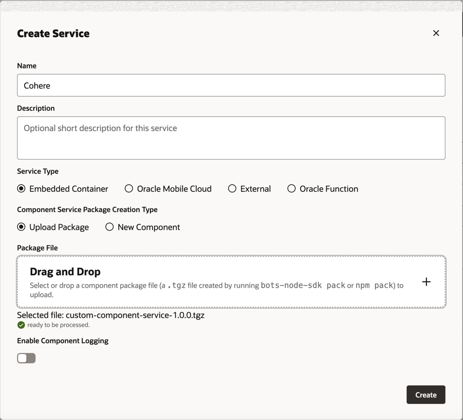

# ODA_LLM
This is a step-by-step tutorial on how to use LLM in ODA.

The original tutorial link is [Access Cohere from Your Skill](https://docs.oracle.com/en/cloud/paas/digital-assistant/tutorial-llm-cohere/#introduction).

# Use case 
For this tutorial, the LLM that you're going to integrate a skill with is the Cohere model. 
The skill will use this model to generate an email to a sales team about their progress on closing a deal with a company called Elemental Design.

# Objective
- Create a `REST service` that provides access to the `Cohere` model for your `Oracle Digital Assistant` instance.
- Create an `event handler` that transforms the `REST payloads` to and from the format used by `Oracle Digital Assistant`.
- Add a state to the dialog flow that connects users to the `LLM service provider`.
- Add the prompt that describes the email for the `Cohere` model.
- Test the prompt.

# Prerequisites
- Access to `Oracle Digital Assistant` Version `23.10` or higher
- A REST service for Cohere. This includes:
  - A REST POST endpoint to Cohere's Command model 
  - A Cohere-provided bearer token

- Sample `provider-specific request` and static response payloads

# Tasks
## Task 1: Cohere Authentication
Cohere supports three methods for authentication and authorization to protect your connectors from unauthorized use:
- Service to Service Authentication
- OAuth 2.0
- Pass-Through

For this tutorial we are using [Service to Service Authentication](https://docs.cohere.com/docs/connector-authentication#option-1-service-to-service-authentication).

---

To get a `Cohere API key`:
- sign up for a `Cohere` account: [Dashboard](https://dashboard.cohere.com/)
- request an API key from the Cohere dashboard: [Api-keys](https://dashboard.cohere.com/api-keys)

Developers should keep their API key `secret`, monitor their usage, handle errors gracefully, and test their applications thoroughly before deploying them to production.


## Task 2: Create the REST Service for the Cohere Model
Refer to [Cohere API reference docs](https://docs.cohere.com/reference/about) to understand more how this works.

For tutorial, we are interested at `/generate` endpoint: [Generate](https://docs.cohere.com/reference/generate).

This is the `payload` format
```json
{
    "prompt": "Generate a fact about our milky way", 
    "model": "command",
    "num_generations": 1,
    "stream": true,
    "truncate" : "NONE",
    "max_tokens": 300,
    "temperature": 0.9,
    "k": 0,
    "stop_sequences": [],
    "return_likelihoods": "NONE",
  ...
}
```

This is the `response` format
```json
{
  "id": "string",
  "prompt": "string",
  "generations": [
    {
      "id": "string",
      "text": "string",
      "index": 0,
      "likelihood": 0,
      "token_likelihoods": [
        {
          "token": "string",
          "likelihood": 0
        }
      ]
    }
  ],
  "meta": {
    "api_version": {
      "version": "string",
      "is_deprecated": true,
      "is_experimental": true
    },
    "billed_units": {
      "input_tokens": 0,
      "output_tokens": 0,
      "search_units": 0,
      "classifications": 0
    },
    "warnings": [
      "string"
    ]
  }
}
```

---
1. Expand `Settings`, then select `API Services`.
2. Click `LLM Services` tab.
3. Click the dropdown `Import LLM Services`.
4. Navigate to `/artifacts/LLMService-CohereLLM.yaml` and open it.
5. Using the `API token` from **Task 1** fill the `Bearer Token` of the service we've just imported.
6. Test the request and make sure you have `200 Success` status code.

## Task 3: Import the Mock REST Service
1. Expand `Settings`, then select `API Services`.
2. Click `REST Services` tab.
3. Click the dropdown `Import REST Services`.
4. Navigate to `/artifacts/RESTService-Tutorial_OpportunityDetails.yaml` and open it.

## Task 4: Import the Starter Skill
1. Click `Development` and then select `Skills`.
2. Click `Import Skill`.
3. Navigate to, and then select the `/artifacts/Generate_Email_Skill_XXX(1.0).zip`. Then click Open.

## Task 5: Connect the Skill to the Cohere Model

We're now going to enable the skill to access the Cohere REST service by creating a custom component with an event handler that transforms the REST payloads into formats that are accepted by both Cohere's provider and Oracle Digital Assistant.

1. Click `Components` in the left navbar. <br> 
2. Click `Add Service`.
3. Navigate to `/artifacts/custom-component-service-1.0.0.tgz` and open it.<br> 
4. Click Create

## Task 6: Define the Cohere LLM Service for the Skill
1. Click `Settings` in the left navbar. <br> 
2. Open the Configuration page. <br> 
3. In the `Large Language Models Services` section (located near the bottom of the page), click `+New LLM Service`.
4. Complete the following fields

    | Field                  | Value            |
    |------------------------|------------------|
    | Name                   | CohereService    |
    | LLM Provider           | CohereLLM        |
    | Transformation Handler | cohere_transform |
    | Mock                   | false            |
    | Default                | true             |
5. Click the Save icon. <br> 

## Task 7: Integrate the Model with the Skill
1. Click `Flows` icon in the left navbar. <br> 
2. In the `GetCompanyDetails` state, click The menu icon and then select `Add State` from the menu. <br> 
3. Select `Service Integration`.
4. Select `Invoke Large Language Model`.
5. Enter `GenerateEmail` in the Name field.
6. The dialog flow now includes the `GenerateEmail` and the `showLLMError` state. <br> 
7. Click the `GenerateEmail` state.
8. In the Component tab, select `CohereService` for the `LLM Service field`.
9. Add the `Prompt` and `Prompt Parameters` <br> 
    ```
    You are a professional email writer. Draft an email to the ${OPPORTUNITY} sales team for the following purpose: ${TOPIC} considering the following details about the opportunity:
    
    Opportunity details:
    
    ${OPPORTUNITY_DETAILS}
    
    Email Signature:
    
    ${EMAIL_SIGNATURE}
    
    - Your email should be concise, and friendly yet remains professional.
    - Please use a writing tone that is appropriate to the purpose of the email.
    - Ensure to make it obvious when the opportunity is to close.
    - Optionally include the things that are important to the customer when making their buying decisions
    - If the purpose of the email is negative; for example to communicate miss or loss, do the following: { Step 1: please be very brief. Step 2: please and do not mention activities }
    - If the purpose of the email is positive or neutral; for example to congratulate or follow-up on progress, do the following: { Step 1: the products section is the main team objective to achieve, please mention it with enthusiasm in your opening paragraph. Step 2: please motivate the team to finalize the pending activities. }
    - Remove signature block
    ```
   
10. The prompt text references the variable values that are passed in for the: 
 - OPPORTUNITY 
 - TOPIC
 - OPPORTUNITY_DETAILS
 - EMAIL_SIGNATURE <br> <br>

   To provide the LLM with the parameter values it needs to generate the email, you need to provide `FreeMarker expressions` for each parameter. Because the parameters provide the LLM with values from various sources (composite bag entity items and the OpportunityDetails REST service), the FreeMarker syntax will vary. To add these parameters: <br> 

11. Click Add icon next to `Prompt Parameters`. <br> 

       a. Enter the parameter name in the `Name field`
    
       b. Enter the static value or FreeMarker iterator expression in the Value field
    
       c. Click `Save`
    
       | Paramter            | FreeMarker Expression                    | Variable Value resource                              |
       |---------------------|------------------------------------------|------------------------------------------------------|
       | OPPORTUNITY         | `${EmailDetail.value.Opportunity.value}` | Composite Bag Entity (list value item)               |
       | TOPIC               | `${EmailDetail.value.Topic}`             | Composite Bag Entity (STRING item)                   |
       | OPPORTUNITY_DETAILS | `${OpportunityDetail}`                   | Flow-scoped variable; value provided by REST service |
       | EMAIL_SIGNATURE     | `${EmailSignature}`                      | Flow-scoped variable (static value)                  |

12. Expand the `User Messaging` section of the Component tab. <br> 
13. Set `Use Streaming` is set to False so that the message is delivered in its entirety, not incrementally. We recommend that you disable streaming for Cohere models.<br> 
14. For the `Standard Actions`, remove all the actions except for `Undo`. <br> 

## Task 7: Test the Prompt with the Prompt Builder
To test the prompt, you need to add mock values for the referenced parameters. 
The tone and content of the model's output is based on these values. 
You can have the model generate random values by clicking `Generate Mock Values`, but to control the output, you need to add your own.

1. In the Component tab, scroll back to the top and click `Build Prompt` to open the Prompt Builder. <br> 
2. Click `Edit`.
3. Enter value for the parameter in the `Mock Value field`. When you're done, click `Apply`. <br> 
    
    | Parameter          | Mock Value       |
    |--------------------|------------------|
    | EMAIL_SIGNATURE    | John Smith       |
    | OPPORUNITY_DETAILS | Completed        |
    | OPPORTUNITY        | Elemental Design |
    | TOPIC              | Congratulations  |
4. After you've completed the mock values, click Generate Output.

## Task 8: Test the Prompt with the Skill Tester
Now that you've verified that the LLM can receive the skill's input, you're ready to interact with it in the Skill Tester.
1. Open the `Skill Tester` by clicking `Preview` (located at the upper right). <br> 
2. Enter the following request: 
    ```
    Send an email to the Elemental Design sales team that congratulates them on the progress and let them know that we should talk strategy for closing in tomorrow's meeting.
    ```
   
